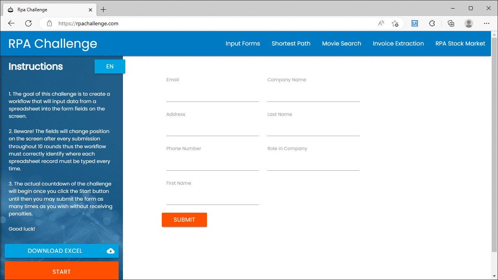
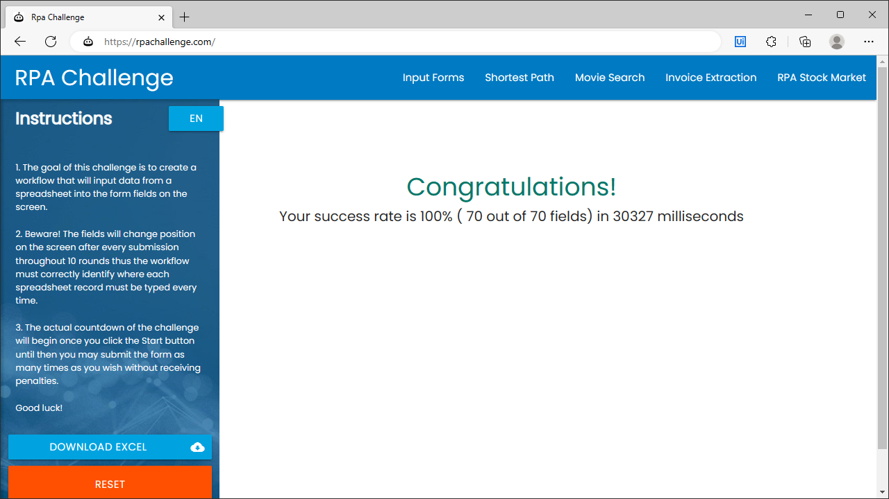

Widely known in RPA education and with automation enthusiast is the website rpachallenge.com with its changing "Input Forms".

Originating from a UiPath Academy course "Get Started with RPA Development", currently available for v2020.10, its automation goal is to enter data from an Excel file into fields that are changing positions.

A total of 10 datasets needs to be entered, either from a file freshly downloaded or provided with the course material. The version in the course material contains inconsitent data that the course then proceeds to explain how to handle.

If done (somewhat) properly the success rate and the time it took to enter 10 datasets.

In true gamification spirit the duration became some kind of a online phenomenon with people from various backgrounds and a multitude of automation tools tryping to surpass each other in execution speed.

Here the link to the UiPath Academy course where the website challenge originates from: 
https://academy.uipath.com/courses/get-started-with-rpa-development-v202010

The course itself actually dives below the surface and explains control flow, arguments of invoked workflows, string operations, email (attachment) automation, debugging and exception handling as well as the Modern Design Experience.

Over the years the website was not available at its prominent location rpachallenge.com but for some time was only available at rpachallenge.azurewebsites.net .

Video Transcript
–
 

Hello and welcome to this introduction to development with UiPath Studio.  

In this demo, we will sample the key knowledge areas covered in the RPA Developer Foundation learning plan to build our first process. The tools, activities and features used in this demo will be covered in-depth in subsequent courses. For the best experience, we encourage you to build along with this video.  

The goal of the process we are building is to read the latest email in the user's Outlook Inbox that has "New Task" as the subject line.  

It will download the attached excel file and then mark the email as read.  

The rows in the Excel file contain employee names and their job titles. One row at a time, the process will type this data into the RPA-Challenge website and will submit the form.  

You will notice in the Excel file, that the first and last names are combined into one cell, while the online form has two separate input fields. This will require us to split this field to separate the first name from the last name.  

To begin, let's create a new project of Process type named Process User Data.   

We will provide a brief description of the program's goal as well.  

The starting screen for our project is displayed. On the left-hand side, we can see the Project panel. It enables us to view the contents of the current project, add folders, open the file location, manage dependencies and adjust project settings.   

Projects are based on activities, which are organized into workflow files. An empty new project will contain only the Main.xaml workflow file. Our process can be broken down into two separate functions: the first to download the Excel file from the Outlook email and extract the data and the second to process the data and enter it into the online form.    

To organize these two tasks, we will add two new workflows with the Sequence layout to the project.    

To create a workflow, we just need to right click inside the Project panel, select Add and Sequence.  

The first workflow will be named GetData.  

The second workflow will be named ProcessData.  

We will learn more about workflows and workflow layouts in the Variables, Arguments and Control Flow in Studio and the Project Organization in Studio courses.   

Let’s access the Get Data workflow and start building it.  

The Designer panel for the Get Data workflow is displayed. This is where we can build our automation by managing the activities added to the current workflow file.   

Note that a Sequence container has already been added for our activities.   

Let’s update the display name and add a meaningful annotation to describe the purpose of the sequence.  

To do this, we will right-click the sequence and select Annotations, Add Annotation.   

We will learn more about best practices in the Project Organization in Studio course.   

OK, we are ready to start adding activities to this workflow. Let’s open the Activities panel.  

The Activities panel shows available activities that can be added to the current workflow. We can search for activities by name and optionally by description using the search box at the top of the panel.  

Let’s add a 'Get Outlook Mail Messages' activity to the workflow.  

Again, we’ll update the display name and add an annotation.  

We will learn more about email activities in the Email Automation with Studio course.   

In the Properties panel, let’s click on the ellipses in the Filter field to open the Expression editor, and in double quotes, specify that we are only interested in emails where the subject line is: "New Task."  

We'll enable the 'MarkAsRead' option and set the Top field to one. This will limit the number of emails processed.  

We need to store the output of this activity in a variable. So, we’ll click on the Output Messages field and press CTRL+K to create a new variable here.   

We will provide the name MailMessages for the new variable.  

Notice that the variable appears in the Variables tab. You will learn more about variables in the Variables, Arguments and Control Flow in Studio course.  

To store the email's attachment locally, let’s add the Save Attachments activity.  

We must add the 'Mail Messages' variable to the Mail Messages field and specify that only the first email in the generated list should be processed. This is done through a reference to the MailMessages variable at index zero.  

MailMessages(0).Attachments(0).Name

If you want to know more about working with collections, stay tuned for the Data Manipulation in Studio course.  

To extract the information in the Excel file into a DataTable variable that is easily handled in UiPath Studio, we’ll add a Workbook Read Range activity to the workflow.  

Excel is one of the most widely used target applications for automation projects. We will learn more in the DataTables and Excel Automation with Studio course.   

For the workbook path, we will reference the name of the first attachment of the first email in the list.    

We will also set the range to a pair of empty double quotes to tell the activity to read the entire contents of the Excel file.  

Lastly, we want to pass the generated DataTable to the ProcessData workflow. To do this, instead of saving the output of the Read Range activity to a variable, we must use an argument.  

To create a new argument, we will press CTRL+SHIFT+M in the DataTable output field and specify out_dt_UserData as the name.  

We can view all the arguments used by a workflow in the Arguments tab at the bottom of the screen.  

If you’re curious about what arguments are, why we are using one here and what the direction property is, it will all become clear in the Variables, Arguments and Control Flow in Studio course.  

The Get Data workflow is complete. Let’s save our changes.   

It’s time to start building the ProcessData file.   

As always, we’ll update the name and supply a meaningful annotation to the sequence.  

Now that we have read the email attachment and stored the contents of the Excel file in a Data Table, we want to type the user details taken from the Excel file into the RPA-Challenge form.  

Our process will interact with a browser and we are planning to achieve this via UI Automation activities. We will explore this topic in-depth in the UI Automation with Studio course.  

Note that Studio provides two UI Automation Design Experiences: the Classic Experience and the Modern Experience. For this project, we are planning to use modern activities.  

To make these activities available in our project, we will click the filter at the top of the Activities panel and enable the 'Show Modern' option.  

Let’s drag the Use Application/Browser activity onto the workflow to indicate the application we want to interact with.    

Then, we’ll click the "Indicate application to automate" link and select the Chrome browser window that shows the RPA-Challenge website.  

Next, we need to loop through the rows of information stored in the DataTable. To do this, we will add a For Each Row activity. You will learn more about iterative structures in the Variables, Arguments and Control Flow in Studio course and specifically about this loop in the DataTables and Excel Automation with Studio course.  

As the DataTable was stored in an out argument in the GetData workflow, here we must add an in argument of the same type.    

This time, we will use the Arguments tab to create it.   

Let’s add an argument named in_dt_UserData, verify the direction is “in”, and set the argument type to DataTable.  

We will provide the newly created argument as the input for the 'For Each Row' activity.  

We now need to populate the online form's text fields with data pulled from rows in the data table. We will use three Type Into and one click activity.  

Let’s drag the first modern Type Into activity inside the ‘For Each Row’ loop.   

We’ll click on the "Indicate target" link and select the website's 'First Name' input field.  

If you’re curious about how the Robot identifies target UI Elements and how we can configure the process to manage more complex situations, we can explore this in the UI Automation with Studio and Selectors in Studio courses.   

Now what should we provide as input for the Type Into activity? As you may recall, the first and last names are combined into a single cell in the Excel file, but they must be entered separately in the online form. This will force us to split this single string into two, with the space between the names used as the separator.  

In the 'Type This' field, we will get the text value associated with the current row's 'name' column, convert it to the string datatype, and then call the split method, specifying that the String should be split based on the blank space characters encountered.   

row(“Name”).ToString.split(“”c)(0)

We will specify index zero to get the text associated with the first half of the split string.   

We will learn much more about string methods in the Data Manipulation in Studio course.  

Let’s repeat this process for the Last Name field. This time, we will use the Expression editor for the Text field in the Properties panel. We will use the same expression, but specify index 1 to get the second half of the split string.  

row(“Name”).ToString.split(“”c)(1)

Now, we’ll add a third 'Type Into' activity to populate the 'Role in Company' field in the online form.  

For this activity, we will reference the “Role in company” column in the DataTable.  

new(“Role in Company”).ToString

Finally, let’s add the click activity to submit the online form.  

We’ll click the 'indicate target on screen' link, choose the orange Submit button as the target, and click the validate button. Everything looks good.   

The addition of the click activity concludes the Process Data workflow. Let’s save all our changes.  

We can close the ProcessData and GetData workflows.  

Let’s click the link on the center of the screen to open the Main workflow.  

One last thing to do before we can run our project. We need to call the GetData and ProcessData workflow files in the Main workflow to form a single process.  

Let’s navigate to the Project panel and drag the GetData workflow onto the Main workflow.  

An Invoke Workflow File activity is automatically created. An orange box indicates an unmapped argument. We’ll click on the Import Arguments button, and in the window that appears, use the CTRL+K shortcut to map the out argument to a new variable named dt_UserData. This means that the DataTable extracted in GetData will be passed to this variable in Main.  

Next, we’ll drag the ProcessData sequence below GetData, and again, click on the 'Import Arguments' field.   

Now we will map the in argument to the dt_UserData variable. Since the variable has already been created, we only need to add its name in the field without using the Ctrl+K keyboard shortcut.  

This mapping allows the DataTable already passed to Main to be used by logic contained in the ProcessData workflow.  

If mapping arguments doesn’t feel instantly clear, don’t worry, we will explore this in more depth in the Variables, Arguments and Control Flow in Studio and Project Organization in Studio courses.    

Let’s save our changes to the Main workflow.  

OK, it looks like we’re done for now! It’s time to test our project! Let’s click Run.  

The process runs well, the Outlook email is read, the attached Excel file is extracted to a DataTable, and the RPA-Challenge website's form is iteratively filled in.  

However, the process doesn't run to completion. We have encountered a runtime execution error. It’s good to note that errors are one of the key reasons why it’s so important to rename activities.   

Based on the error message, can you tell what’s causing the error?   

In the next video, we will use some of the Studio Debugging and Exception Handling features to identify the source of the exception and address it.   

Thank you for watching and hope to see you next time!  

Video Transcript
–
 

Hello, and welcome back to the introduction to development with UiPath Studio part two.  

In this video, we will explore just a few of the options UiPath Studio provides to help you debug problems and create robust solutions. We will also deploy our process locally to UiPath Assistant and to UiPath Orchestrator in the cloud.  

When we last ran our automation, the user data read from an Excel spreadsheet caused an error when it was processed for form entry on the RPA-Challenge website. Did you figure out what caused the exception?  

Let’s work through it together. We’ll run the project again and inspect the details of the error message again.  

After several successful form submissions, an exception is thrown, and the execution is terminated. The error message reads: The index was outside the bounds of the array.  

We are also informed that the exception is generated by a Type Into activity.  

More information is available if we click on the details button.    

The exception message can also be seen in the Output window. To keep the error message in view, let’s dock the Output window to the screen.  

Since we know the issue is in the ProcessData workflow, let's add a breakpoint to the 'type into first name' activity.   

To do this, we’ll right click on the activity and select 'Toggle Breakpoint.'    

Breakpoints are used to purposely pause the debugging process on an activity, which may trigger execution issues.  

Breakpoints can also be set through the Ribbon option when the debug tab is selected. The various debugging features are explored in more detail in the Debugging in Studio course.  

With the breakpoint set, let's run the project in debug mode.  

The execution pauses when it reaches the breakpoint set on the 'Type Into First Name' activity.  

The values of arguments and variables currently in scope can be inspected in the Locals panel. We can see the name "John Smith" and the role of "Analyst", which was read from the first row of the downloaded Excel file.  

The 'Step Into', 'Step Over' and 'Step Out' options allow us to incrementally proceed with the execution.   

We can move through individual activities one at a time with the press of the Step Into button.  

When we step into the next activity, the currently visible variables are displayed in the Locals panel, along with the data that was generated by the previous activity.  

We can continue to click "Step Into", but the error does not occur on the current iteration of the For Each Row loop.  

Let’s speed things up a bit. First, we’ll right click the current row-data and add it to the Watch panel so we can easily monitor it.   

Next, we’ll click the Continue button instead of 'step into.' This will cause a full iteration of the loop to run until the breakpoint is encountered again.  

Notice how the data displayed in the Watch panel changes on each iteration.  

We are now on the row where the name to be parsed is Jessie.  

When we click continue here, the execution stops on the 'Type Into Last Name' field and the Output window displays the exception: The Last Name's Index is outside the bounds of the array.  

Since the Name column contains one name and no spaces, after the split method is called, there is no element at index one to be used by the Second Type into activity.    

The implication is that not all the input data this process will receive is correctly formatted. We need to enhance our process with exception handling to manage these types of situations.  

Let’s stop the execution and focus on the body of the For Each Row loop in the Process Data workflow.  

We’ll right click on the activity and select "Surround with Try Catch."   

The Try Catch activity catches a specified exception type in a sequence or activity, and either displays an error notification or dismisses it and continues the execution.   

The logic behind the Try Catch block along with other exception handling mechanisms are covered in detail in the Error and Exception Handling in Studio course.  

Let’s move to the 'catches' section and choose to handle the broadest exception type, System Exception.  

We’ll add a Log Message activity to the body of the Catch Block.  

For this example, we will select 'Error' for the level, and compose a meaningful error message.  

“Exception encountered:” + exception.Message

The meanings of the different severity levels and logging best practices are covered in the Introduction to Logging in Studio course.   

OK, let’s see how our exception handling mechanism works.   

Let’s save our workflow file, and run the project.   

The data entry runs smoothly.   

The process no longer terminates early when the record that contains the name 'Jessie' is encountered. Instead, a message is written to the Output panel and execution continues.  

When the execution completes, we can see the result in the Output panel.   

It looks like our process works well. However, you might have noticed that another entry in the Excel file does not contain a last name but did not generate an exception either. Looking at the data, can you figure out why? The Data Manipulation in Studio course holds some clues.   

OK, it’s time to publish our project to UiPath Orchestrator so it can run outside of UiPath Studio.  

We’ll click the Publish button.  

Let’s provide a version number for the package, make sure that the package is published to the Personal Workspace, and click Publish.  

Now let's open UiPath Assistant and choose to install the process locally.   

Then, we’ll click the start button to have UiPath Assistant run the process.  

The automation runs successfully from start to finish, even when bad data is read from the Excel file. Great!  

Note that if we click on the green connection icon atop UiPath Assistant, we can view the process' status and log files in UiPath Orchestrator.  

In the Automations section in our personal workspace, we can see the version we just installed.  

We can also see the history of previous versions that were deployed and the status of the jobs they ran.  

And we can also see the log files generated when the process is run through UiPath Assistant.  

We will explore all these features and much more in the Orchestrator For Developers course.   

With this we conclude this video.  We hope you found this demo useful and that it got you thinking about building your own automations.   

This was only a taste of how we build, harden, test and deploy UiPath Automations. To learn more about each step in the process and the many more features available, we encourage you to continue with the RPA Developer Foundation learning plan.   

Thank you for watching and until next time, happy automation!  

