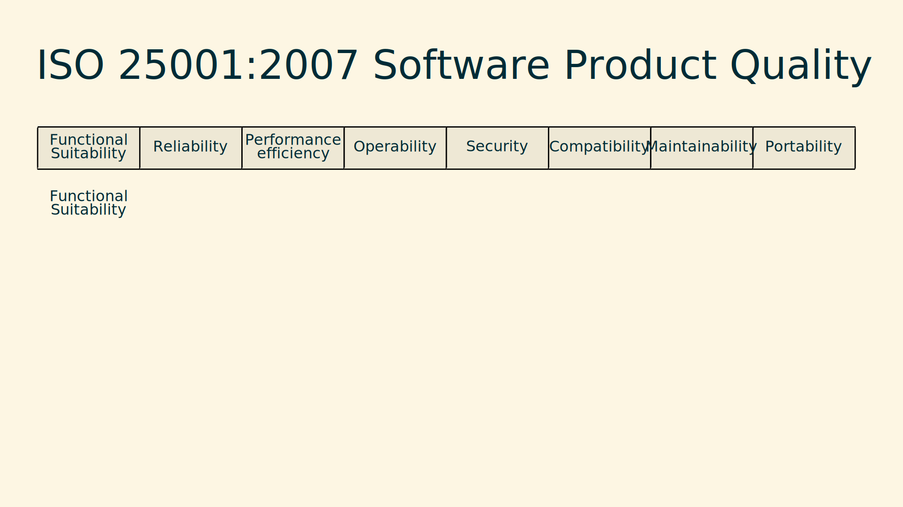

@see: https://iso25000.com/index.php/en/iso-25000-standards/iso-25010

{:class="resize"}

- Functional Suitability

  - Functional Completeness
  - Functional Correctness
  - Functional Appriopriateness

- Reliability

  - Maturity
  - Availability
  - Fault tolerance
  - Recoverybility

- Performance efficiency

  - Time behaviour
  - Resource Utilization
  - Capacity

- Usability

  - Appropriateness recognizability
  - Learnability
  - Operability
  - User error protection
  - User interface aesthetics
  - Accessbility

- Security

  - Confidentiality
  - Integrity
  - Non-repudiation
  - Accountability
  - Authenticity

- Compatibility

  - Co-Existence
  - Interoperability

- Maintainability

  - Modularity
  - Reusability
  - Analyzability
  - Modifiability
  - Testability

- Portability

  - Adaptability
  - Installability
  - Replaceability
