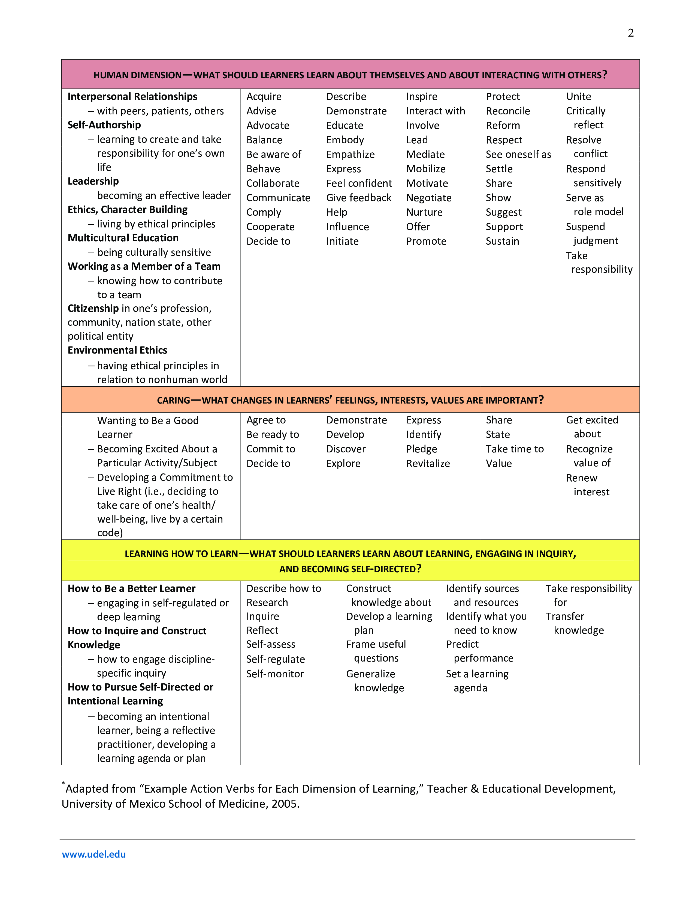

# Measurable action verbs for learning objective

## Low Level

- define
- describe
- discuss
- explain
- explore
- identify
- indicate
- list
- memorize
- name
- recall
- recognize
- restate
- state
- summarize
- write

## Medium Level

- apply
- assemble
- calculate
- compare
- contrast
- combine
- defend
- demonstrate
- detect
- determine
- differentiate
- discriminate
- distinguish
- employ
- examine
- experiment
- implement
- investigate
- locate
- measure
- operate
- predict
- perform
- reproduce
- repair
- set up
- sequence
- solve
- specify
- use
- test
- verify

## High Level

- analyze
- appraise
- argue 
- arrange
- assess
- build
- choose
- classify
- compose
- conclude
- critique
- debate
- diagram
- draw
- estimate
- extrapolate
- formulate
- generalize
- judge
- illustrate
- instruct
- label
- order
- organize
- plan
- prioritize
- propose
- rank
- represent
- score
- select
- theorize
- value
- weigh

## Problematic verbs

The following are verbs to avoid because these verbs are difficult to quantify and evaluate.
For example, how does one assess a student’s understanding or appreciation?

- appreciate
- approximate
- be aware of
- be familiar with
- become acquainted
- comprehend
- cover
- demonstrate an understanding of
- familiarize
- gain knowledge of
- know
- learn (about)
- provide
- realize
- reflect
- see
- study
- understand

## Source

Based on Michigan Technological University's "Measurable action verbs for learning objectives" accessed on 2021-12-26 at the following URL:
https://www.mtu.edu/ctl/instructional-resources/syllabus/action-verbs4-objectives.pdf

# University of Delaware

Source: https://ctal.udel.edu/files/2020/06/tot-2020-verbs-for-significant-learning-objectives-3.pdf