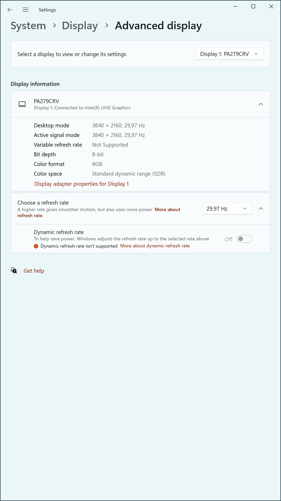

# What a KVM Taught Me About Monitor Wake-Up Timing, EDID Delays, and HDMI Source Detection

## 0. TL;DR

In my TESmart HKS402 KVM-based home setup, a newly added 4K monitor began falling back to 1080p @ 60 Hz after a few days, giving me headaches on my daily driver: an Intel NUC with a relatively modest internal GPU.

The most surprising discovery was how critical timing becomes in what appears to be a straightforward dual-monitor setup. The interaction between KVM behavior, monitor firmware, GPU detection logic, and OS configuration created a fragile system that only behaved consistently when precisely tuned.

It turns out that signal order, wake-up timing, and handshake behavior matter just as much as raw hardware capabilities. When both monitors are connected through the KVM, the secondary FullHD monitor often responds faster to HDMI probes, causing the system to prioritize it at boot.

This timing discrepancy explains the observed fallback behavior: the GPU allocates bandwidth for the first detected display, potentially leaving insufficient headroom for the main 4k monitor to initialize at its native 4K resolution.

Here the key steps I took to resolve the issue:

- Set the main 4k monitor (a PA279CRV) to a fixed HDMI input (e.g. HDMI2)
- Set the secondary FullHD monitor (a PA248CRV) in source auto-select mode: This introduced a natural delay in EDID response, helping prioritize the primary display during the handshake process.
- Apply the desired refresh rate manually in Windows settings. Took me some attempts to reset the settings, e.g. deleting the EDID with CRU.exe, and powercycling every device and making direct cable connections with the NUC to get a "fresh" EDID readout, only to indroduce the KVM back into the setup later.

## 1. Intro – The Setup That Should Have Worked

<!-- - NUC system with dual HDMI outputs
- Two ASUS monitors: PA279CRV (4K) and PA248CRV (FHD, portrait)
- KVM switch (HKS402) for HDMI and USB sharing
- Goal: Consistent dual-monitor boot with primary display at 4K 30Hz to conserve bandwidth -->

The test environment consisted of an Intel NUC system equipped with dual HDMI outputs, connected to two ASUS monitors via an HKS402 HDMI/USB KVM switch. The primary monitor, an ASUS PA279CRV, supports 4K resolution and was intended to operate in landscape mode. The secondary monitor, an ASUS PA248CRV, supports a native resolution of 1920×1200 and was configured in portrait orientation.

The objective was to establish a stable dual-monitor configuration where the PA279CRV consistently initialized as the primary display at 3840×2160 resolution, preferably running at 29.97 Hz to remain within the HDMI 2.0 bandwidth constraints imposed by the NUC's integrated graphics. The KVM was used to facilitate seamless input and peripheral sharing between systems, without sacrificing display quality or configuration stability.

<!--  -->

<!--  -->

<!-- -->

## 2. The Mystery – Wake-Up Timing and Display Downgrades

<!-- - Inconsistent results across reboots
- Sometimes PA279CRV (main) booted at 1920x1080 @ 60Hz
- CRU rules were ignored
- Display order swapped unexpectedly -->

During initial testing, the dual-monitor setup produced inconsistent results across system reboots. In several cases, the primary monitor, PA279CRV, failed to initialize at the expected 3840×2160 resolution and instead defaulted to 1920×1080 at 60 Hz. These incidents occurred despite Custom Resolution Utility (CRU) being configured to prioritize a 29.97 Hz refresh rate for bandwidth conservation.

In addition to resolution downgrades, the display ordering within Windows occasionally shifted, with the secondary monitor PA248CRV appearing as the primary display. These irregularities suggested that either the operating system or the integrated GPU was responding to timing variations in monitor availability or EDID detection, rather than honoring CRU-defined preferences.

Attempts to resolve the issue through static configuration alone proved unreliable, prompting a more detailed investigation into timing, cabling, and monitor response behavior.

<!--  -->

<!--  -->

## 3. The Investigation – Reproducing, Ruling Out, Rewiring

<!-- - Used Custom Resolution Utility (CRU) to enforce 29.97 Hz on 4K
- Verified EDID extension blocks and detailed resolutions
- Removed secondary display from setup to simplify
- Booted with direct HDMI cables, then through KVM
- Adjusted BIOS video port priority, verified fast boot settings
- Explored monitor OSD settings: fixed HDMI source vs. auto-detect -->

The troubleshooting process involved a systematic series of tests to isolate variables influencing the inconsistent display behavior. A number of assumptions were evaluated, and multiple configurations were trialed to pinpoint the source of the issue.

Initial steps included enforcing a 29.97 Hz refresh rate at 3840×2160 using Custom Resolution Utility (CRU) and validating that only the desired detailed resolutions and extension blocks were defined. Despite these measures, the system occasionally reverted to a lower resolution during boot.

A simplified test setup was created by removing the secondary display and observing behavior with only the PA279CRV connected directly via HDMI. In this state, the expected resolution and refresh rate consistently applied, suggesting interference only occurred in the dual-monitor configuration or through the KVM.

Several key paths were explored:

- Rebooting with direct cables versus routing through the KVM
- Testing multiple HDMI cables and ports to eliminate signal quality issues
- Power-cycling the KVM and displays to reset potential EDID memory states
- Switching BIOS primary display from DisplayPort to HDMI
- Verifying that fast boot was disabled to allow proper EDID negotiation during POST
- Locking the input on PA279CRV to HDMI2 while allowing PA248CRV to remain in source auto-select mode

Some approaches proved ineffective. For example:

- CRU sort order did not influence the default resolution selected by Windows
- Deleting all 60 Hz entries in CRU did not reliably force 29.97 Hz unless selected manually in the Windows GUI
- BIOS display port priority changes did not prevent fallback behavior when both displays were active

Collectively, these steps clarified that resolution fallback and display reordering were linked more to EDID availability timing than to configuration alone, setting the stage for deeper insights into the role of hardware timing and KVM behavior.

<!--  -->

<!--  -->

## 4. Findings – What Actually Happens

<!-- - KVM adds delay to EDID handoff
- PA248CRV responds faster to HDMI probe
- Windows occasionally prioritizes faster display during boot
- If display is downgraded at boot, CRU entries might be ignored until manually set
- Once CRU-enforced settings are confirmed in Windows, they persist reliably across reboots -->

Analysis of the testing revealed that the KVM switch introduces a non-negligible delay in EDID signaling, which can interfere with the GPU’s display initialization sequence. When both monitors are connected through the KVM, the PA248CRV often responds faster to HDMI probes, causing the system to prioritize it during boot.

This timing discrepancy explains the observed fallback behavior: the GPU allocates bandwidth for the first detected display, potentially leaving insufficient headroom for the PA279CRV to initialize at its native 4K resolution. As a result, the main display is occasionally downgraded to 1920×1080 at 60 Hz.

Other key findings include:

- Windows defaults to the fastest responding monitor if no explicit primary display is remembered.
- CRU-defined modes are only applied if the associated resolution is already selected or confirmed via the Windows display settings GUI.
- Once a custom refresh rate (e.g., 29.97 Hz) is manually applied through the GUI, Windows tends to retain it across reboots—unless EDID detection order shifts again.
- The physical state of the monitors (e.g., powered off, source cycling) significantly impacts which EDIDs are processed first.
- Fixing the PA279CRV input to HDMI2 and allowing PA248CRV to scan inputs helped preserve correct initialization order.

<!--  -->

<!--  -->

<!--  -->

<!--  -->

## 5. Mitigations – What Works Reliably

<!--- Fix main monitor source input (disable auto-detect)
- Delay secondary monitor wake-up (via OSD or power)
- CRU + Windows GUI to confirm settings before rebooting
- BIOS primary port set to DisplayPort (or override with fixed cable routing)
- Maintain consistent cable config and KVM state (powered on, connected)-->

Several actions were found to stabilize the configuration and ensure consistent initialization of the primary display at the desired resolution and refresh rate.

- **Ensure that the 4k monitor is connected to the "main" NUC output**: This model has 1 HDMI and 1 DisplayPort output. The HDMI output is the primary one, so the 4k monitor should be connected to that one.

- **Set the main monitor (PA279CRV) to a fixed HDMI input**: Disabling automatic input detection on the main monitor reduced EDID delay and ensured faster response during system boot.

- **Leave the secondary monitor (PA248CRV) in source auto-select mode**: This introduced a natural delay in EDID response, helping prioritize the primary display during the handshake process.

- **Apply the desired refresh rate manually in Windows settings**: While CRU made the custom mode available, Windows required manual confirmation to consistently apply it on subsequent reboots.

- **Use CRU to expose only necessary resolutions**: Removing higher refresh rate entries (e.g., 60 Hz) reduced the risk of fallback modes being auto-selected.

- **Power-cycle the KVM and maintain stable cable connections**: Ensuring the KVM remained powered and the display path unaltered helped preserve EDID consistency between reboots.

- **Disable Fast Boot in BIOS**: This allowed the GPU sufficient time to read complete EDID data from all connected displays during POST.

- **Set BIOS primary display to HDMI**: This aligned the firmware preference with the actual cabling and usage scenario, improving display initialization order.

Together, these mitigations established a reliable dual-monitor configuration where the primary monitor retained its intended resolution and refresh rate, even with the additional complexity introduced by the KVM switch.

## 6. Conclusion – What Surprised Me

<!-- - Monitor wake-up speed matters more than expected
- KVM switches don’t just relay HDMI — they affect timing and signal flow
- CRU is powerful, but only honored when the GPU/OS receives correct EDID
- Manual confirmation in Windows GUI can "lock in" refresh rates effectively -->

The most surprising discovery was how critical timing became in what initially appeared to be a straightforward display setup. The interaction between KVM behavior, monitor firmware, GPU detection logic, and operating system configuration created a fragile system that responded inconsistently unless precisely tuned.

While the KVM switch was expected to serve only as a passive HDMI relay, it significantly influenced EDID propagation timing. In combination with differences in monitor wake-up behavior and input scanning modes, this created a race condition that affected which display was initialized first and how resolution and refresh rates were applied.

Custom Resolution Utility (CRU) proved indispensable for exposing custom refresh rates, but ultimately, these settings were only effective if the GPU received complete and timely EDID data. Manual intervention within Windows remained necessary to reliably select and retain the preferred display configuration.

The lesson for similar dual-monitor environments—especially when bandwidth is constrained—is that signal order, wake-up timing, and handshake behavior matter as much as the raw capabilities of the hardware. A configuration that fails under default behavior can become reliable with deliberate timing offsets and clear input priorities.

This investigation highlights how nuanced low-level display negotiation can be, particularly in mixed setups involving KVMs or multiple high-resolution monitors. Ensuring stability often depends on understanding the interplay between physical hardware timing and software-level policy decisions.

## Appendix: Hardware Used

- **Intel NUC 11ATKC4** w/ Celeron N5105, 1x HDMI output, 1x DisplayPort output
- **ASUS PA279CRV** (4K, HDMI2 input, source fixed)
- **ASUS PA248CRV** (FHD, rotated, source auto-detect)
- **KVM Switch**: HKS402 HDMI 2.0, USB switching
- **Software**: CRU 1.5.2, Intel Graphics Command Center, Windows 11

